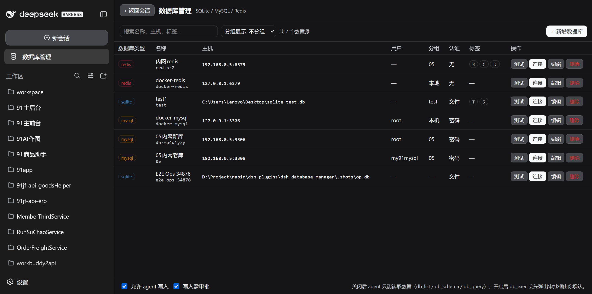
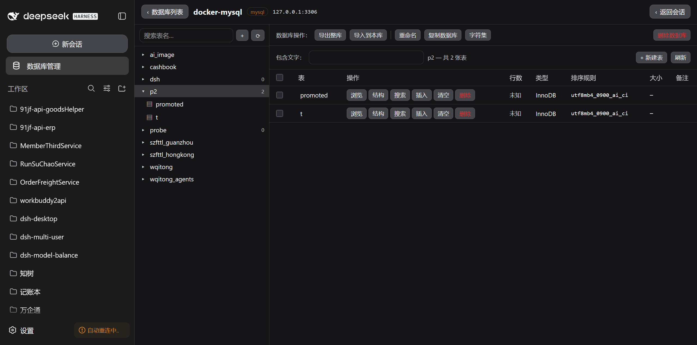
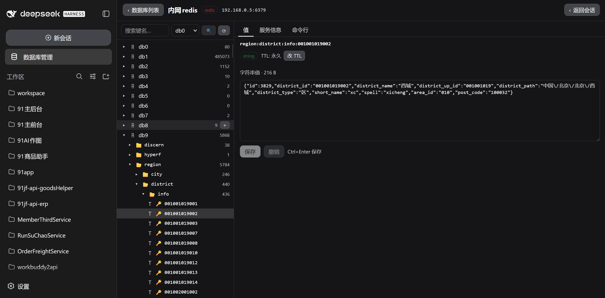

# dsh-database-manager

[](LICENSE)
[](https://nodejs.org)
[](https://github.com/deepseek-ai/deepseek-harness)

中文 | [English](README.en.md)

为 [DeepSeek Harness](https://github.com/deepseek-ai/deepseek-harness) Web GUI 提供**数据库管理**面板：侧边栏一个「数据库管理」入口，打开后统一管理 **SQLite / MySQL / Redis**，并提供一组受写保护闸门约束的 agent 工具。

不用离开 DSH，也不用另开 Navicat / RedisDesktopManager / redis-cli：在同一个界面里查数据、改结构、跑 SQL、翻 Redis 键值。

<p align="center"></p>

## 目录

- [功能特性](#功能特性)
- [界面截图](#界面截图)
- [数据库引擎支持](#数据库引擎支持)
- [工作原理](#工作原理)
- [安装](#安装)
- [卸载](#卸载)
- [写保护](#写保护)
- [agent 工具](#agent-工具)
- [配置与数据](#配置与数据)
- [开发](#开发)
- [能力边界](#能力边界)
- [许可证](#许可证)

## 功能特性

### 数据源列表（面板首页）

- 顶部工具条：左侧搜索（名称 / 主机 / 标签）+ 分组显示（不分组 / 按类型 / 按分组 / 按标签），右侧「新增数据库」
- 列表列：数据库类型、名称、主机、用户、认证、标签、操作
- 操作列：**测试**（连通性 + 延迟 + 服务端版本）、**连接**（进入对应数据库面板）、**编辑**、**删除**
- 每个数据源带独立的**只读**标记与**标签 / 分组**，可运行时增删，不必改配置文件、不必重启

### MySQL / SQLite 面板（类 phpMyAdmin）

左侧库 / 表树（搜索过滤、视图标记、行数），右侧六个标签页：

| 标签页 | 能做什么 |
| --- | --- |
| **浏览** | 分页与跳页、点列排序、按索引排序、列名下方显示列注释、分页行右侧显示表注释、双击单元格就地编辑、行编辑 / 复制到插入表单 / 删除、多选批量删除。也用于承载 SQL 查询的结果集 |
| **结构** | 改列 / 删列 / 新增列（与建表页同一套控件）、主键编辑、唯一约束、索引管理、非重复值计数；操作列固定在表格最右 |
| **SQL** | 编辑器，Ctrl+Enter 执行；SELECT 的结果落在浏览页 |
| **搜索** | phpMyAdmin 的依例查询（QBE）：每列一行，填了值的行才参与，条件之间是 AND |
| **插入** | 按列类型给控件；「要插入的行数」可生成多组独立表单，整批一个事务提交 |
| **操作** | 照 phpMyAdmin 的操作页：移动表 / 表选项 / 复制表 / 表维护 / 删除数据或表 |

另有 **导入导出**：SQL 转储（结构 / 数据 / DROP 可选，整库或单表）与 CSV（当前表），均在浏览器侧完成。

### Redis 面板（类 RedisDesktopManager）

左侧**目录树**，右侧三个标签页：

- **目录树**：每个逻辑库（db0–db15）是一个根节点，key 按名字里的 `:` 分层折叠为目录，行尾显示该目录下的键数；顶部过滤框在已展开的层里匹配键名
- **值**：按类型渲染并**可编辑**——`string` 改值（保留 TTL）、`list` 按下标改 / 删 / 追加、`set` 增删成员、`hash` 逐字段改、`zset` 改分值与成员；`stream` 只读并说明原因
- **服务信息**：版本、内存、连接数、各库键数
- **命令行**：任意命令 + 回复，作用于当前选中的库

树上的写操作：目录行悬停出现 **＋**（在该目录下新增键，前缀自动补上）与 **🗑**（删除整个目录）；key 行悬停出现 **🗑**。TTL 可改可清（「设为永久」走 `PERSIST`，因为 `EXPIRE key 0` 会删掉整个键）。

### 大库可用性

按层加载 + 大库一次性建索引，使千万级 keyspace 也能浏览：

- **小库（< 100 万键）逐层扫描**：点开某个目录才扫该前缀，一次层级扫描同时得出子目录与每个子目录的精确键数。实测本机 Docker Redis 打开 26.5 万键库的根层 0.7–1.4 s，展开一个 20 万键的同层分支 1.0 s
- **大库（≥ 100 万键）改为遍历一次、建全树、缓存**：`SCAN MATCH p:*` 的成本 70% 花在把键名搬过网络（实测走 50 万键：返回键名 5.2 s，不返回 1.5 s），所以在服务端用 Lua 把键名折叠成「目录 → 计数」，网络开销基本归零（实测 1950 万键约 52 秒、传输约 0 KB）。Redis 单线程，脚本执行期间会阻塞其它客户端，因此脚本有界、由主机侧驱动游标分多次推进，批次大小按「单次阻塞几十毫秒」取
- 大库**直接开始建索引**，边建边看，顶部有真实进度条（`已扫描 X / Y，发现 N 个目录`），不做前置确认框——这个操作是只读的、分批推进的，真正的备选方案只有「干脆不浏览这个库」
- **不留漏目录的可能**：索引是完整遍历而非采样。实测一个 1950 万键的库里存在**只有 1 个键**的目录（`hyperf`、`shopadmin`），采样会漏掉它们，而目录列表正是用户判断「库里有什么」的依据
- 目录与计数**从不撒谎**：一层扫描一定跑到末尾，没有键数上限；目录总数超过索引上限（20 万）时**报错而不是静默丢目录**
- 写入时只做局部更新（新增 / 删除键只改受影响的祖先与自身层级），不重扫全库

> 排序用的是不区分大小写的 code-unit 比较，不是 `localeCompare`。实测 20 万键：`localeCompare` 要 23.3 s，这个要 166 ms——这就是「能渲染」和「看起来卡死」的区别。

### 以「一次操作的结果落在哪里」为准则的几处取舍

**只要产生结果集，结果一律落在浏览标签页。** SQL 与搜索两个标签页执行 SELECT 后都跳转到浏览标签页，而不是各自在下方渲染一张表：改动前两种做法各有各的表格，同一批行在不同标签页里长得不一样。

- **写语句留在 SQL 页**：`INSERT`/`UPDATE`/DDL 没有结果集可放进表格，而「已影响 N 行」正是用户要看的那句话；跳走等于把它藏起来
- **结果集不假装成表**：浏览工具条上的分页、按索引排序、导出/导入全部作用于**表**，而结果集没有表、没有主键、没有总行数，所以这些控件在结果集期间整块不出现，且**结果集只读**
- **搜索把条件带到浏览页**，于是结果集是真正的表读：可翻页、可按索引排序、有主键时还能直接编辑匹配行。浏览页顶部显示已应用的筛选条件并提供一键清除

**插入页的「留空 / NULL / 空字符串」是三件不同的事**，所以给了三个明确入口，而不是靠一个空文本框去猜：

| 操作 | 写进 SQL 的东西 | 结果 |
| --- | --- | --- |
| 留空 | 该列不进 `INSERT` | 引擎填它的 DEFAULT，没有 DEFAULT 则 NULL |
| 勾 NULL | 该列 = NULL | 显式存 NULL（与留空不同：留空会用 DEFAULT） |
| 勾空字符串 | 该列 = `''` | 只有 NOT NULL 且无默认值的文本列给这个勾 |

`TINYINT` 给的是自己填值的输入框，不是「是/否」下拉：`BOOL`、`BOOLEAN` 与 `TINYINT(1)` 在服务端是同一个类型（实测 `information_schema.COLUMNS` 对三种写法一律返回 `tinyint(1)`），给前两者两个选项就等于给后者也提供，而一个存着 2、3 或 -1 的 `TINYINT(1)` 根本填不进去。

**无主键的表不提供行内编辑与批量删除**：行由主键标识，没有主键的「删除这三行」说不清是哪三行。主键存在时批量删除走一次请求、一个事务。

**引擎不支持的功能禁用并写明原因，而不是藏起来**：藏起来会让按文档找过来的用户找不到控件。例如 SQLite 上没有可搬的目标库、没有忠实的复制表语句、没有可改的表选项、没有 REPAIR，这几块都渲染出来但禁用，理由写在块里。

大表上的两类危险操作会在按下去之前说清代价：需要整表重建的操作（SQLite 的改类型 / 删列 / 改主键）在确认框里写明「会新建表、搬数据、删旧表、改名，全程一个事务，大表需要时间」；数据库重命名会说明 MySQL 没有 `RENAME DATABASE`，实现是建库→搬表→删原库。

## 界面截图

### 数据源列表

<p align="center"></p>

统一管理三类数据源：类型、名称、主机、用户、认证方式、标签一屏可见，每行带测试 / 连接 / 编辑 / 删除。面板底部是写保护的两个策略开关。

### SQL 面板

<p align="center"></p>

左侧库 / 表树，右侧表列表与库操作（导出整库、导入到本库、重命名、复制数据库、字符集、新建表）。进入某张表后是浏览 / 结构 / SQL / 搜索 / 插入 / 操作六个标签页。

### Redis 面板

<p align="center"></p>

左侧按 `:` 分层的键树（显示每个目录下的键数），右侧「值 / 服务信息 / 命令行」三个标签页。值页显示键类型、TTL 与内容，可保存或撤销（Ctrl+Enter 保存）。

## 数据库引擎支持

| 引擎 | 驱动 | 说明 |
| --- | --- | --- |
| **SQLite** | `node:sqlite` | Node 内置，**零依赖**（需 Node ≥ 22.5） |
| **MySQL** | `mysql2` | 插件依赖，连接池 |
| **Redis** | `ioredis` | 插件依赖，按 db 缓存客户端 |

三个引擎的可用性会在面板顶部显示；缺哪个依赖会显式提示，而不是静默失败。驱动的加载是懒执行且带错误翻译的，因此只装 SQLite 的部署也能正常启动。

SQLite 直接连接本地 `.db` 文件，适合临时查看 / 修改；MySQL 走连接池，30 分钟空闲回收，连接字段变更时先丢弃旧驱动。

## 工作原理

```
┌──────────────┐   /api/dsh-database/*    ┌──────────────┐   mysql2 / ioredis    ┌──────────┐
│   浏览器      │ ───────────────────────→ │   DSH 宿主    │ ───────────────────→  │  数据库   │
│ (面板 / 树)   │ ←─────────────────────── │  (插件路由)   │ ←───────────────────  │          │
└──────────────┘   JSON（脱敏投影）        └──────────────┘   查询 / 命令          └──────────┘
                                                 ↑
                                         授权门（agent 面）
                                                 ↑
                                          ┌──────────────┐
                                          │  agent 工具   │
                                          └──────────────┘
```

插件分为两半：

- **host 半**（`src/index.ts` → `lib/index.js`）
  - `store.ts` 数据源存储（原子写、脱敏投影、持久化写入策略）
  - `pool.ts` 按需建连的驱动池，30 分钟空闲回收
  - `drivers/` 三引擎适配器，统一 `SqlDriver` / `RedisDriver` 契约
  - `routes.ts` `/api/dsh-database` 路由族（**用户面**，用户点击即授权）
  - `tools.ts` agent 工具（**模型面**，经 `auth.ts` 授权门）
- **client 半**（`src/client/index.ts` → `lib/client.js`）
  - 注册 `sidebar.panellist` 插槽（侧边栏入口）与 `main` 插槽（居中面板）
  - 两者用同一个 id `database-manager`：shell 的 `PanelRow` 点击时调用 `layout.selectPanel(id)`，而点击任意会话行会调用 `selectPanel(null)`，因此「点会话返回」是 shell 内建行为，插件无需干预

SQL 标识符一律先按保守文法校验、再按各引擎规则加引号（MySQL 反引号、SQLite 双引号）；值一律走绑定参数，绝不拼进语句文本。

## 安装

插件装进某个 dsh 的 **web profile**，然后重启那个 dsh 的 web 服务。两个动作缺一不可。

```bash
# 通过 npm
npx @deepseek-ai/dsh plugin --profile web add dsh-database-manager

# 从 GitHub
npx @deepseek-ai/dsh plugin --profile web add github:nabin-qq273274877/dsh-database-manager

# 本地开发（link 到你的 checkout）
npx @deepseek-ai/dsh plugin --profile web add link:/path/to/dsh-database-manager
```

也可以直接复制下面这段提示词给 AI：

```
请帮我安装 dsh-database-manager 插件，仓库地址：https://github.com/nabin-qq273274877/dsh-database-manager
按照 README 中的说明进行安装和配置。
```

装完后重启 `dsh web` 并刷新页面，侧边栏「新建会话」下方会出现「数据库管理」入口。

### 也可以作为 bundle patch 层

插件自带 `cordis.patch.yml`，等价于 `bundles` 里那一项：

```yaml
- insert:
    - id: database-manager
      name: 'dsh-database-manager'
```

### 从源码装入某个 profile

开发本插件时可以用仓库自带的脚本，它只做两件事——都是 loader 真正需要的：

```bash
npm run build                                   # 先产出 lib/index.js + lib/client.js
pwsh -File scripts/install-into-profile.ps1 -DshHome "$env:USERPROFILE\.dsh"            # 只安装
pwsh -File scripts/install-into-profile.ps1 -DshHome "$env:USERPROFILE\.dsh" -Port 3080 # 安装并重启 + 验证
```

1. 在 `<profile>/node_modules/<插件名>` 建一个**目录链接**指向工程目录
2. 把 `<插件名>` 追加进 `<profile>/package.json` 的 `dsh.profile.bundles`

脚本不使用包管理器：`pnpm install` 会重新解析整个依赖树，而 `file:` 依赖在这个解析下容易产生半安装状态。用链接 + 改 bundles 这两步，profile 里其余依赖树一个字节都不会动。

> **注意 `DSH_HOME`**：同一台机器上可以有多个 dsh（桌面版用 `…\com.dsh.desktop\dsh-desktop\dsh-home`，命令行版默认用 `~/.dsh`）。要装进哪个，`-DshHome` 就得指向哪个。脚本在重启那一步会主动清空 `DSH_HOME`，让新进程按自身默认规则解析 home，而不是继承调用方进程的环境。

## 卸载

```bash
npx @deepseek-ai/dsh plugin --profile web remove dsh-database-manager
```

## 写保护

agent 的写操作有两层闸门，均**失败即拒绝**（fail-closed）：

1. **单调 guard**（`ctx.tools.guard`）——判定在派发前生效。agent 写入开关关闭、或目标数据源被标记只读时，`db_exec` **直接硬拒**，不弹框（答案已知，不必打扰用户）
2. **审批瀑布**（`tools/pre-execute` 返回 `{kind:'ask'}`）——开关打开且目标可写时，每次写入弹出 DSH 原生审批框由用户确认。若当前环境没有 approval 服务，框架会**自动判为拒绝**；用户拒绝或取消同样拒绝，因此「无人应答」绝不会等于「放行」

面板底部的两个策略开关：

| 开关 | 默认 | 作用 |
| --- | --- | --- |
| **允许 agent 写入** | 关 | 关闭时 agent 只能读取；开启后才可能执行 `db_exec` |
| **写入需审批** | 开 | 开启时每次写入都要你点确认 |

另外每个数据源有独立的**只读**标记：勾选后，即使全局开启了 agent 写入，该数据源也不会被 agent 修改。

**GUI 的写入不经过这道门。** 你在面板里点「保存」/「执行」，这个动作本身就是授权，和终端工具一致。Redis 树上新增 / 删除键、以及右侧的值 / TTL 编辑同理：那是面板的**用户面**，与 agent 的写入门无关。

## agent 工具

| 工具 | 作用 |
| --- | --- |
| `db_list` | 列出已配置数据源（id、引擎、名称、主机、用户、认证、标签、只读） |
| `db_schema` | 查看库 / 表 / 列 / 索引结构（Redis 返回各库键数） |
| `db_query` | 只读查询（SQL 的 SELECT/WITH/SHOW/DESCRIBE/EXPLAIN/PRAGMA；Redis 的读命令） |
| `db_exec` | 写操作（受用户开关与审批保护） |

agent 侧对 Redis 走同一套工具：`db_query` 只接受读命令，`db_exec` 接受写命令（`SET` / `DEL` / `LPUSH` …），两者都受上面的开关与审批保护。

## 配置与数据

- 数据源配置：`$DSH_HOME/dsh-database.json`（POSIX 下权限 0600）
- 口令以**明文**存于该用户私有文件，与 dsh-ssh 的主机存储同一信任模型——不要读取或转发该文件内容
- 密码从不下发到浏览器或模型：接口返回的是 `summarize()` 脱敏投影（只给出 `hasPassword`）

## 开发

```bash
npm install
npm run typecheck   # tsc --noEmit
npm test            # vitest：单元 + SQLite 真实链路 + 构建产物集成 + 客户端 bundle
npm run build       # lib/index.js（host）+ lib/client.js（browser）
```

测试与验证链路：

| 脚本 | 作用 |
| --- | --- |
| `scripts/probe-surface.mjs` | 离线加载 host 产物，列出注册的工具 / 路由 / prompt section |
| `scripts/install-into-profile.ps1` | 装入某个 dsh profile（链接 + bundles），可选重启并验证 |
| `scripts/check-template-literals.mjs` | 校验「模板字面量里嵌代码」的文件没有裸反引号 |
| `scripts/check-locale-placeholders.mjs` | 校验 `t('key', {...})` 提供的占位符与模板一致 |

E2E 脚本（`scripts/e2e-*.mjs`）用真实浏览器 + 真实数据库逐项断言界面**行为**而非标记，写入后回读服务端核对；`scripts/probe-*.mjs` 是针对具体引擎行为的探查与最小复现。它们的完整清单与各自钉住的缺陷见维护者文档。

## 能力边界

这个面板的定位是**日常查数据、改结构、跑 SQL 的轻量面板**，不是 MySQL 服务器管理套件。相对 phpMyAdmin 明确**不做**的部分：

- 用户与权限管理（建用户 / 授权 / 改密码 / 账号锁定）
- 服务器状态、进程、变量、字符集、引擎、插件、binlog、复制页
- 视图 / 触发器 / 存储过程 / 函数 / 事件的创建与管理
- 关系视图与 Designer、跟踪与版本化、分区管理
- 图表、GIS 可视化、数据变换、打印视图、PDF schema 导出
- 导出只支持 SQL 转储与 CSV（无压缩、无结果集导出、单表 20 万行截断）
- SQL 页一次一条语句，无语法高亮 / 自动补全 / 格式化，无查询历史与书签
- 结构页索引通路只支持 primary / unique / index，**不能建 FULLTEXT 与 SPATIAL 索引**（建表页可以）

有一份与 phpMyAdmin 5.2.3 的逐项功能对照，覆盖浏览 / 结构 / 插入 / SQL / 搜索 / 导入导出 / 库级操作 / 用户权限 / 其他九大块，以及本面板相对 phpMyAdmin 的独有能力。它属于内部研究记录，未随本仓库公开。

## 许可证

[MIT](LICENSE)
